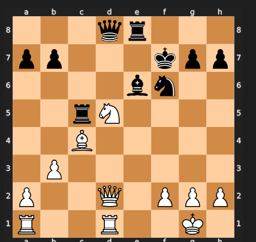
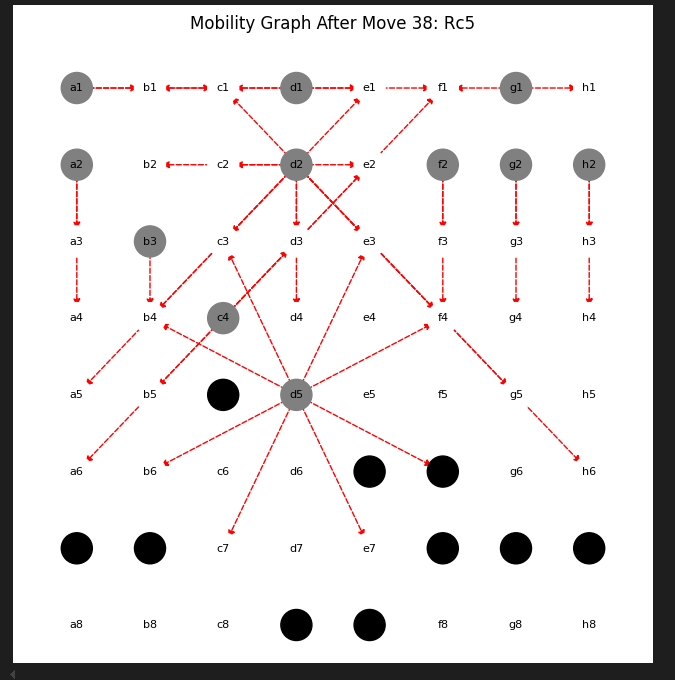
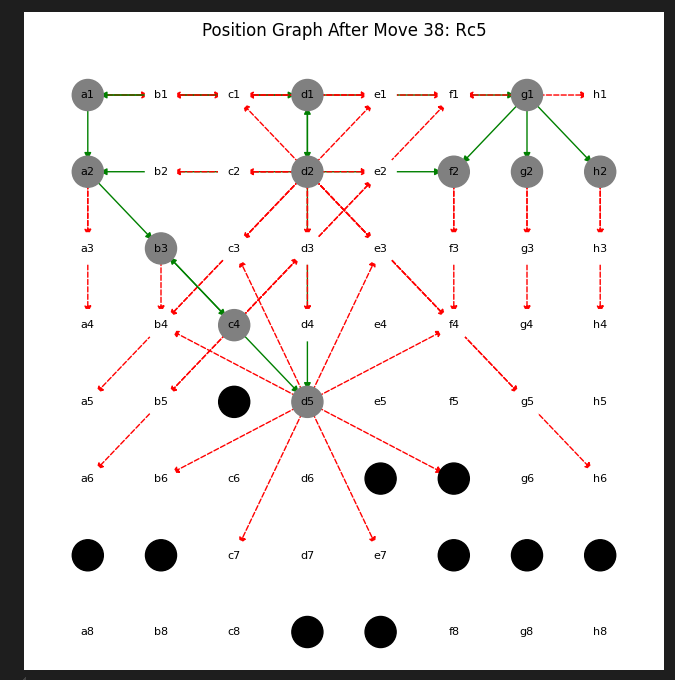

# ♟️ Chess Position Strength Classification (AI + Graph-Based Analysis)

## 🚀 Overview
This project builds a machine learning system to classify chess positions into **Strong, Neutral, or Weak** using **Stockfish engine evaluations** and **graph-based feature engineering**.

Unlike traditional approaches that rely only on board state, this project models chess positions as **networks**, capturing piece interactions, mobility, and structural relationships.

---

## 🎯 Problem Statement
Chess engines like Stockfish provide strong evaluations but lack **interpretability** for human players.

This project aims to:
- Convert chess positions into **interpretable features**
- Use ML to classify position strength
- Provide insights into **why a position is strong or weak**

---

## 🧠 Methodology

### 🔹 Pipeline Overview
- Parse large-scale PGN datasets (Lichess)
- Evaluate positions using **Stockfish**
- Convert positions into **graph representations**
- Extract structural + domain features
- Train ML model for classification

📌 Full pipeline explained in: :contentReference[oaicite:0]{index=0}

---

## ♟️ Example Chess Position



---

## 🔗 Graph-Based Representation

### 🔹 Mobility Graph
Represents all legal moves available from a position.



---

### 🔹 Position Graph
Combines mobility + support relationships to capture full board dynamics.



---

## 📊 Features Extracted
- 20+ engineered features including:
  - Piece mobility
  - Central control
  - King safety
  - Pawn structure
  - Graph metrics (degree, clustering, centrality)

---

## 🤖 Model

- Model: **Random Forest Classifier**
- Hyperparameter tuning: **GridSearchCV**
- Feature sets:
  - Graph-based (mobility, connectivity)
  - Domain-based (material balance, structure)

---

## 📈 Results

- ✅ Accuracy: **74%**
- F1 Scores:
  - Strong: 0.83  
  - Neutral: 0.73  
  - Weak: 0.68  

---

## 📉 Key Insights

- Graph-only features → ~50% accuracy  
- Adding domain knowledge → **74% accuracy**  
- Important factors:
  - Pawn structure
  - Piece coordination
  - Mobility

---

## 🧰 Tech Stack

- Python  
- Stockfish  
- NetworkX  
- scikit-learn  
- pandas, numpy  
- matplotlib, seaborn  
- Jupyter Notebook  

---

## 📁 Project Structure

```

.
├── code
│   ├── Data_generator.ipynb
│   └── model-training-testing.ipynb
├── dataset
│   ├── combined_dataset_feature.csv
│   └── graph_based_Chess_Features.csv
├── Feature_Documentation.markdown
├── model_weights
│   └── model_weights_compressed.zip
├── SMAI_Project_Overview.pdf
└── readme.md

````

---

## ▶️ How to Run

```bash
pip install numpy pandas matplotlib seaborn scikit-learn
jupyter notebook
````

Run:

```
code/model-training-testing.ipynb
```

---

## 📄 Documentation

* Feature details: `Feature_Documentation.markdown`
* Full report: 

---

## 🔥 Key Highlights

* Combines **AI + Graph Theory + Chess Engine**
* Works on **large-scale real game data**
* Provides **interpretable chess insights**
* Uses **network-based representation**

---

## ⚠️ Limitations

* Relies on Stockfish evaluations
* Neutral vs weak classification can be improved
* Threshold-based labeling

---

## 🚀 Future Work

* Graph Neural Networks (GNNs)
* Real-time chess evaluation API
* Multi-engine evaluation
* Explainable AI (SHAP, LIME)

---

